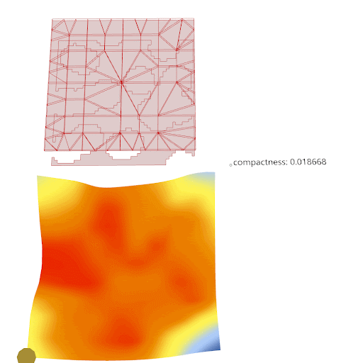

# VAE Latent Design Exploration
Rhino/Grasshopper and web-based platform for latent parametric design exploration with Variational AutoEncoder.

This is a hackathon project developed during AEC Tech 2022. The team members are: Zhenxiang Huang, Vincent Mai, Daniel Gaspar, Mark Membreno, Mohsin Afsar, JP Mendez-Ruiz, Paul Laroque, Mitsuhiro Kuroki, Peter Huang. We are a diverse group with backgrounds in structural engineering, architecture, business and computational design.

./data folder contains training data for the variational autoencoder model

./src folder contains two Jupyter notebook files to train the models, and two Grasshopper files to visualize the design space exploration, and a Rhino.Compute server and index.html for website hosting of the Grasshopper visualization.

./ishigami folder contains training data for Design Project 'Carpet'

 

./voronoi folder contains training data for design project 'Dragonfly Facade'
 
